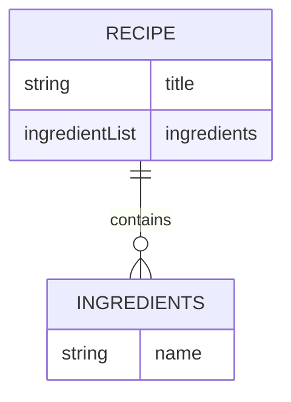

# Recipe Builder App

This application is a recipe builder application.

## Goal

The goal of this application is to allow a user to enter or import a recepie, and will tell the price it will take to make that recipe using the wallmart affliate api.


## How it will work

The way this application will work is that it will be broken down into two different parts.

1. Front End
2. Back End

The back end will be built using spring, and this will allow us to use the wallmart api to fetch the data that will then be used to manipulate the data to be used by our own api to push down to a front end application.

## Steps

First step is to study and get familier with the walmart api, to know what data I can receive and manipulate in order to get a good sense of how the app flow will go.


### Register Kroger API

1. Setup Kroger API Account
2. Study the API


### Creating the backend

First thing we are going to is create the backend using spring boot java.

- [x] Set up a spring boot application.
- [x] Grab the spring boot starters (WebClient PostgresDB and otherstuff)
- [x] Add the API Client secret as enviornment vars
- [x] Get Bearer token using app.
- [x] Create the location backend to get the location ids.

Now that we are able to get the location the next thing we are going to do is pivot and create the database and add the recipes to it.

#### Creating the Reicpe Data

Since I have a Postgres database we need to set the spring dependencies and properties to set this up.

First what we need is to add the dependencies inside the **build.gradle** file here:

```groovy
dependencies {
  //Other depenencies above
  ...
  // Spring data Postgress dependencies
	implementation 'org.springframework.boot:spring-boot-starter-data-jdbc'
	implementation 'org.springframework.boot:spring-boot-starter-data-jpa'
	runtimeOnly 'org.postgresql:postgresql'
  ...
  // Other dependencies below
}
```

Now we need to add the properties inside of the **applicaiton.yml** file:

```yaml
spring: 
  datasource:
    url: jdbc:postgresql://postgresdb:5432/postgres
    username: ${postgres_user}
    password: ${postgres_passwrod}
    driver-class-name: org.postgresql.Driver
  jpa:
    properties:
      hibernate:
        dialect: org.hibernate.dialect.PostgreSQLDialect
    generate-ddl: true
```

What this will do is allows us to connect to the Postgres database and create the appropriate tables that we need for our project without directly interacting with the Database.

After setting up this we need to create the classes that will issentially be the objects that make up the database tables.

Here is the ddl design



It's very simple we will only have two tables one contains the recipes and the other the Ingredients. Here's what the classes look like.

##### Recipes

```java
@Data
@Entity
@NoArgsConstructor
@AllArgsConstructor
public class Recipe {
    @Id
    @GeneratedValue(strategy = GenerationType.AUTO)
    private Long id;
    private String title;
    @OneToMany(cascade=CascadeType.ALL)
    private Ingredient[] ingredients; 
}
```

##### Ingredients

```java
@Entity
@Data
@NoArgsConstructor
@AllArgsConstructor
public class Ingredient {

    @Id
    @GeneratedValue(strategy = GenerationType.AUTO)
    private Long id;
    private String name;
}
```


